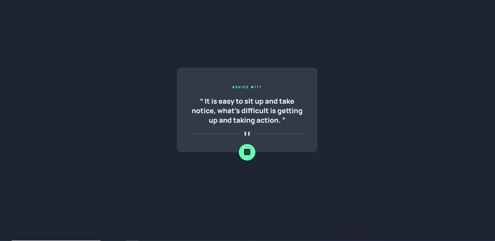

# Frontend Mentor - Advice generator app solution

This is a solution to the [Advice generator app challenge on Frontend Mentor](https://www.frontendmentor.io/challenges/advice-generator-app-QdUG-13db). Frontend Mentor challenges help you improve your coding skills by building realistic projects.

## Table of contents

- [Overview](#overview)
  - [The challenge](#the-challenge)
  - [Screenshot](#screenshot)
  - [Links](#links)
- [My process](#my-process)
  - [Built with](#built-with)
  - [What I learned](#what-i-learned)
  - [Continued development](#continued-development)
  - [Useful resources](#useful-resources)
- [Author](#author)

## Overview

### The challenge

Users should be able to:

- See an advice with ID.
- Get a new advice with ID when pressing the dice button.
- The dice button should glow when pressed.

### Screenshot

### Links

- Solution URL: [https://www.frontendmentor.io/solutions/advice-generator-app-5NoKuZ_vO](https://www.frontendmentor.io/solutions/advice-generator-app-5NoKuZ_vO)
- Live Site URL: [https://larkl.github.io/fm-advice-generator/](https://larkl.github.io/fm-advice-generator/)

## My process

### Built with

- Semantic HTML5 markup
- CSS custom properties
- Flexbox
- Mobile-first workflow

### What I learned

* Some CSS properties like line-spacing for text and blockquote tag importance for semantic.
* Animations using opacity for better performance.

### Continued development

* Try another approach to show a divider and styling.

### Useful resources

- [W3schools](https://www.w3schools.com/) - This helped me dealing with background image styling and glowing effect for the button.
- [CSS tricks](https://css-tricks.com/snippets/css/simple-and-nice-blockquote-styling/) - Quote styling.

**Note: Delete this note and replace the list above with resources that helped you during the challenge. These could come in handy for anyone viewing your solution or for yourself when you look back on this project in the future.**

## Author

- Frontend Mentor - [@lArkl](https://www.frontendmentor.io/profile/lArkl)
